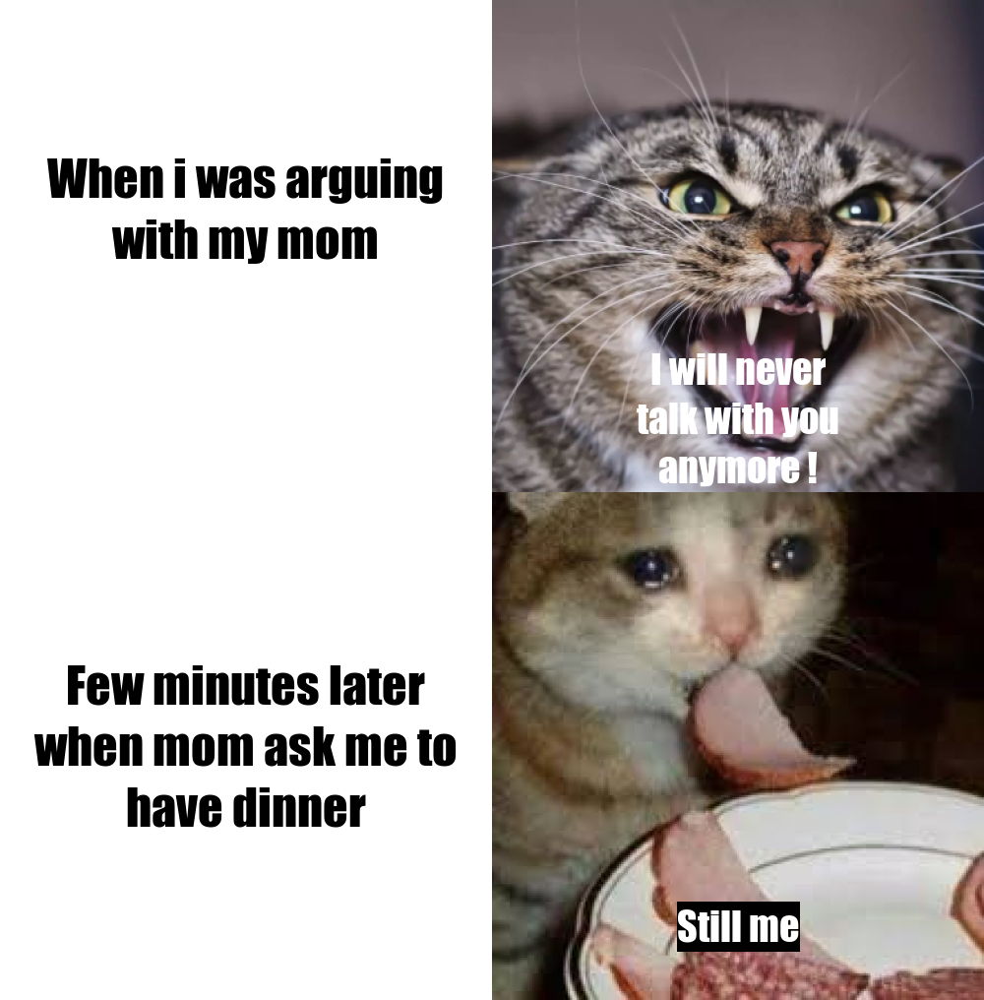

# Hello and welcome

## This is the meme I made for my first assignment, also I've provide the `R` code for it.

I've used functions in [{magick}](https://cran.r-project.org/web/packages/magick/vignettes/intro.html) package to do this meme.  
e.g.: image_read, image_scale, image_blank, image_crop, image_append and image_write.



```
library(magick)
angry_cat <- image_read('https://pic2.zhimg.com/80/v2-8742aacd3924757631da263206d48665_1440w.jpg') %>%
  image_scale(500) %>% image_crop('380x380+50') %>% image_scale('500x500')
  
crying_cat <- image_read('https://encrypted-tbn0.gstatic.com/images?q=tbn:ANd9GcTrgrYRWlXGbKItseR1hKUockMEENDsT2BZeA&usqp=CAU') %>%
  image_scale(500)

text_1 <- image_blank(width = 500, height = 425, color = 'white') %>%
  image_annotate(text = 'When i was arguing\nwith my mom', size = 50, font = "Impact", gravity = 'center')

text_2 <- image_blank(width = 500, height = 516, color = 'white') %>%
  image_annotate(text = 'Few minutes later\nwhen mom ask me to\nhave dinner', size = 50, font = "Impact", gravity = 'center')

angry_cat_new <- angry_cat %>%
  image_annotate(text = 'I will never\ntalk with you\nanymore !', size = 40, color = 'white', font = "Impact", gravity = 'south')

crying_cat_new <- crying_cat %>%
  image_annotate(text = 'Still me\n', size = 40, color = 'white', boxcolor = 'black', font = "Impact", gravity = 'south')

img_pack <- c(text_1, text_2, angry_cat_new, crying_cat_new)

first_row <- c(text_1, angry_cat_new) %>%
  image_append()
  
second_row <- c(text_2, crying_cat_new) %>%
  image_append()

meme <- c(first_row, second_row) %>%
  image_append(stack = TRUE)

image_write(meme, 'my_meme.png')

```


## Below are some informations of this meme
1. Motivation of this meme:
- *It's a little embarrassing to say it, but it's to complete the Assignment.* 🤷‍♂️

___
2. my inspiration for the meme:
- I love cats🐱
- When I was young, I was often beaten by my mother for being naughty.
- **I have to!** Otherwise I'll lose credits 😥😭😢😭  
___
3. source of my meme
- This meme is not original, but a secondary creation of the meme circulating on the Internet
  - The original picture is this one: (click the picture to jump to the website)  
  [](https://www.reddit.com/r/memes/comments/93n2y5/moms_hits_and_call_for_dinner/)
___
4. Use of pictures
- When I looked up the original meme after all works, I found out that the image I used is the same as the original meme,   
 but it is too troublesome to replace the image from scratch, I will be careful not to let something similar happen in the next assignment.  
 
